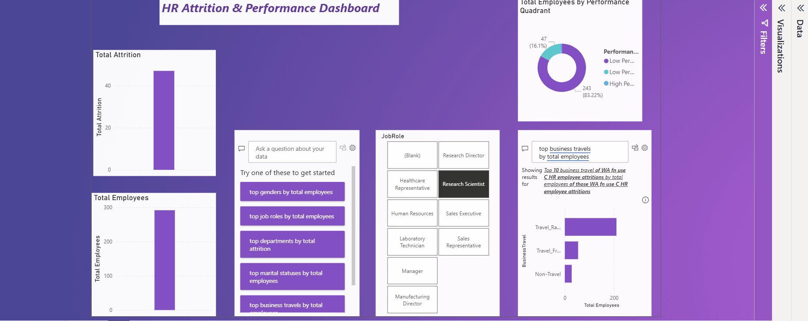

# Power BI: HR Attrition & Performance Dashboard

This is an advanced business intelligence project that analyzes employee attrition against performance data. The goal is to answer the key business question: "Are we losing our high-performing employees?"

This dashboard connects two separate data sources, uses DAX for custom calculations, and is fully interactive.

---

## 🚀 Interactive Dashboard Demo

Here is the final dashboard in action. All visuals (KPI cards, charts, and slicers) are fully interactive and cross-filter each other.

---

## 🛠️ Technical Skills & Tools

* **Data Modeling:** Created a one-to-many relationship in the Model View to link the `HR Data` table with the `Performance Reviews` table on `EmployeeNumber`.
* **DAX (Data Analysis Expressions):** Wrote several DAX measures from scratch:
    * `Total Employees` (using `COUNTROWS`)
    * `Total Attrition` (using `CALCULATE` and `FILTER`)
    * `Attrition Rate` (using `DIVIDE` and formatted as %)
* **DAX Calculated Column:** Wrote a complex, nested `IF` formula (using `RELATED`) to create the `Performance Quadrant` column. This combines attrition status with performance data for powerful insights.
* **Data Visualization:** Built a clean, professional dashboard with a variety of visuals:
    * **KPI Cards** (for main metrics)
    * **Stacked Bar Chart** (for Attrition by Department)
    * **Donut Chart** (for Performance Breakdown)
    * **Slicers** (for Job Role and Gender)
* **Formatting:** Used themes, shadows, and careful alignment to create an attractive, "boardroom-ready" report.

## 📁 Project Files

* **`HR Attrition.pbix`**: The Power BI project file.
* **Data**: The raw `WA_Fn-UseC_-HR-Employee-Attrition.csv,performance_reviews.csv` files used for the project.
